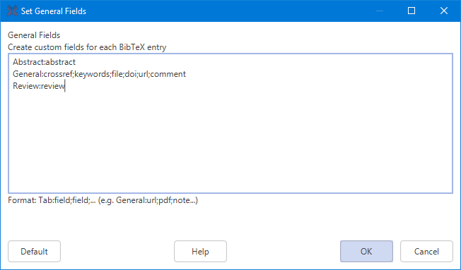

📅 October is here and that means that it's time for 2019's edition of **Hacktoberfest**!
Want to help with the improvement of JabRef and even get a free T-shirt? Start contributing now as part of [Hacktoberfest](https://hacktoberfest.digitalocean.com/) from DigitalOcean.
Check the [open issues](https://github.com/JabRef/jabref/issues), pick one and create a Pull Request. We will review your code and once it is approved it will be merged into the development version.

### JabRef 5.0 development
Since the release of Version 4.3.1 we have been continuously working on fixing and converting the old GUI technology to the new one, JavaFX. 
One of the biggest new features is the redesign of the Main Entry Table with JavaFX. Other parts of the user interface have been converted as well or are currently in the process of being converted.
The new table displays unicode more properly then in earlier JabRef versions, In addition, the column sort order is saved and restored when opening JabRef again.
JabRef now also supports the connection to shared SQL databases over SSL using provided certificates.

[
[
[

