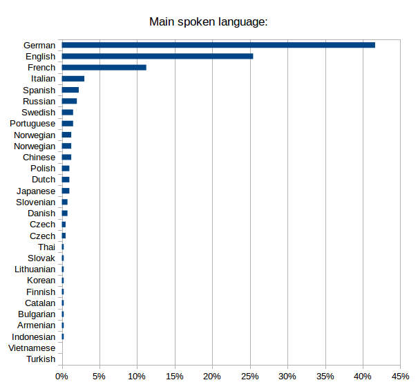
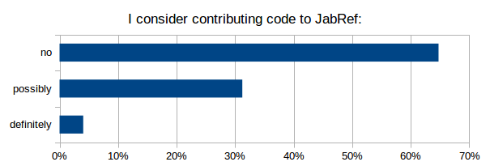
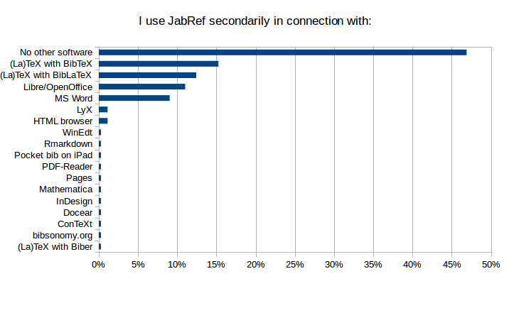
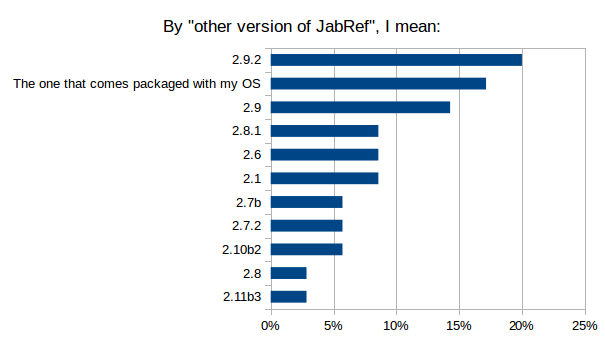
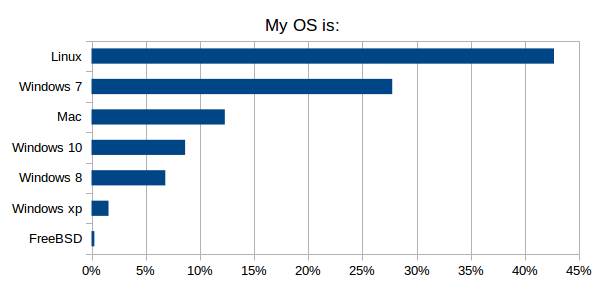
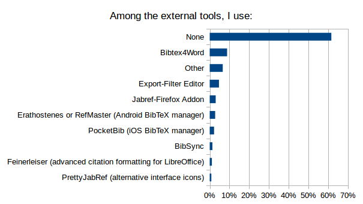
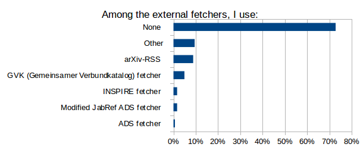
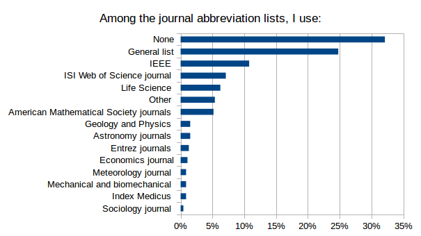

# Result analysis of JabRef survey

## Introduction

To foster its developments, the JabRef core team has carried out an online survey from October 18, 2015 to November 14, 2015. 
We were interested in getting the opinion of community members.

The survey consisted of 3 sets of questions:
- What do you think about the current features?
- Which new features should be included?
- Who are JabRef users?

Total, we got 428 responses, which included 31 incomplete responses.

The analysis of the results is structured in the following order:
- Who are the JabRef users.
- What contribution to expect from users.
- How do they currently use JabRef.
- Which new features should be included.

## Who are the JabRef users

### German and English speakers are the most numerous among the responders

- German were the most numerous responders.
- English speakers represented (only) 25% of responders.

### Context of use is mostly professional, but many usages

(multiple answers allowed)

- More than half of JabRef use is done in a context of professional work.
- Half of use is for studies (including PhD).
- A third is for personal work.

> Conclusion: a wide variety of contexts!

### A few field of activity dominates
Same data, 2 graphs.

- Natural sciences, formal sciences and professions are the dominant fields of activity of the responders.
- Humanities and social sciences represent "only" about 15% of usage.
- A few sub-fields dominate:
	- Physics, computer sciences, engineering and biology makes about 50%.
	- Adding mathematics, chemistry, economics makes 2/3.

## What contribution to expect from users

### JabCon

#### JabRef users are willing to attend.

Among the 100 responders who detailed their interest into attending JabCon,  85% are users.

> Conclusion: Many inputs from users to expect.

#### a webinar will boost the attendance

Among the 360 responders:

- 8% will possibly or definitely attend (i.e. 27 responders).
- 16% would attend an online JabCon webinar instead (i.e. 59 responders).

> Conclusion: A webinar will boost the attendance.

### Time is money, and money is time

#### Code contribution are to be expected

A third of responders could contribute code (among the 346 responders).

> Conclusion: a large base of coders for JabRef development. How to mobilize them?

#### Money donations are to be expected

Only 20% of responders would not make a finantial contribution to foster JabRef development (among the 337 responders).

> Conclusion: money could be raised. How to mobilize the users?

## How JabRef is currently used

### JabRef is their primary bibliographic software

- For 80% of the responders, JabRef is the main bibliographic software.
- For the other 20%, either JabRef is their secondary bibliographic software, or they do not use JabRef.

### If not using JabRef, Zotero, a plain text editor and Mendeley are the most popular

Among the 20% not using JabRef as their primary bibliographic software, numerous alternatives are cited, and the reasons are:

- It works better with my OS (Bibdesk and Bookends for Mac; Citavi for Windows; Erathosthenes for Android)
- Of a better GUI (Erathosthenes, Librarian)
- My colleagues use this other software (Zotero, Citavi, Endnote)
- File format
    - I want complete control over the BibTeX file (emacs and other text editors)
    - My preferred file format is not BibTeX (Text editor for ConTeXt; Mendeley for XML; CiteULike; Endnote)
- Online, Sharing et al.
    - It is online (Mendeley; Zotero)
    - It is integrated in my browser (Zotero)
    - I use a remote file storage (Bibsonomy; Zotero)
    - I can synchronize my database (Mendeley; Zotero)
    - I do collaborative work (Bibsonomy; Mendeley)
- Direct import of references, even from webpages (Mendeley; Zotero)
- PDF file capabilities
    - Extract information from PDF files (Docear; Mendeley)
    - Annotation inside the PDF files (Mendeley) 
    - Management of PDF files (Mendeley; Zotero)
- Tagging and categorizing references is easier (Mendeley; DoCear; Zotero)
- Better automated features (Mendeley, Zotero)
- Better integration with my text-processor (Mendeley; Zotero)
- Additionnally:
    - Better search (Citavi)
    - Better documentation (Endnote)
    - More styles for journal submission (Endnote)
    - Batch editing (Mendeley)
    - Reference completion (Mendeley)
    - Better for basic usage (Unknown text editor)
    - Easier to use (Zotero)
    - Better integration of third party services (Zotero)
    - Auto-export segments for a specific paper (Zotero)

> Conclusion: clear reasons exist for not using JabRef primarily. Features to be added have been given. Do they match the users' priority lists?

### TeX-world softwares dominate the use of JabRef

- The primary software used with JabRef is related to TeX in 80% of the cases.
- Word processors represent the primary software for about 10% of responders. 
- 4% of responders declare using JabRef for itself.

- About half of the responders use JabRef in connection with only one software.
- Bib(La)TeX is the secondary software for about 25% of responders. 
- Word processors represents the secondary software for about 20% of responders. 
- A wide diversity of other software are being used, also most represent a minority.

> Conclusion: while TeX-world remains the primary target, other usages should not be forgotten.

### English is the primary language for the user interface

- About 2/3 of responders use the interface in English .
- 20% in German.
- 5% in French.
- Use of other languages for the interface is quite rare among responders.

50% of German- and French-speaking responders use the interface in their own language.

> Conclusion: how useful are the localizations (versus a better English help, for example)?

### Latest stable version is the most popular

- Two-thirds of the users run the latest stable version.
- As could be expected, few run a development snapshot.

Among the 10% who answered "Other" (i.e. 32 responders), we get:

- An order of stable versions mostly sorted by age.
- About 15% run the version proposed by their OS (and this is likely underestimated).
- Very old versions are still in use.

> Conclusion: since stability is a requirement for most users, and since there will be no more beta versions, some guidance  in choosing the proper version to download is needed.

### The most popular OS are Windows and Linux, then Mac

- There is not an overly-dominant OS:
	- 45% of responders run Windows
	- 43% of responders run Linux
	- 12% of responders run Mac
- Among the Windows versions, Windows 7 is the most popular.
- Windows 10 is already more popular than Windows 8.
- Very few responders are still using Windows XP.

> Conclusion: compatibility with Windows, Linux and Mac is a key feature.

### Hand edition of a BibTeX file is not rare 

- Most of responders edit, at least sometimes, their BibTeX files by hand.

> Note: with a perfect JabRef, they would not edit their BibTeX file by hand...

The analysis of the about 200 reasons given by the responders shows that they are related to:

- Personal taste/habits (7). *Challenge for developers: make JabRef so good that you change your habit/taste.*
- Computers where JabRef is not available. *This underlines the strength of having the database stored in a text file.*
- Mass editing by search & replace (24). *Seems a much-demanded missing feature.*
- Importation and exportation issues:
	- Importation of entries collected from the web (22). *Import filters need to be improved, whether because numerous databases on the web provide wrongly-formatted references, or because the import filter does not match the format definition.*
	- Exportation of entries (8), especially to conform with specific journal citation styles. *Exportation styles should be easier to customize.*
- Solving issues related to character encoding (20). *Improvement in the database cleaning feature*
- Cleaning (23), *Improvement in the database cleaning feature (again)* such as:
	- Deletion of some unnecessary fields.
	- « Search for duplicate » is not good enough in JabRef.
	- Syntax error and bugs in the database.
	- Line breaks in the abstracts
- Need for specific entry types and fields (12). *Make the GUI more friendly with custom fields and entries*
- Text editing is faster for small changes (9). *Will a GUI ever beat emacs?*
- Solving issues related to PDF files (filename and file path) (4). *Improvement in the file management*
- Conflicts when merging changes in a version control system (4). *Make the file format more consistent.*
- Insufficient support of the BibLaTeX format (4). *Improvement in the BibLaTeX format support.*
- Preserve compatibility with other software (3) *Which software?*

Additionally:

- Direct copy-paste of a bibTeX entry is currently faster in a text-editor than in JabRef (1). And it would be if "new entry"->"empty" could be selected (no need to delete the template). *Need for specific button (and a new keyboard shortcut)?*
- When two entries are accidentally copied into one, JabRef keeps silent (1) *Detect this.*
- Editing group tree is tedious in JabRef (1). *Improve group tree editing.*
- Management of abbreviations is tedious in JabRef (1). *Improve abbreviation management*
- JabRef is slow for very large databases (1). *Make JabRef faster*
- To add longer abstracts than appears allowed by default (1). *Is there a limit?*
- JabRef forgets the configured fields (required and optional) for several entry types. So after every start of JabRef for example publisher and address is missing in the required fields tab for the entry type @book. I can add it but after the next start of JabRef it's gone. *A bug?*

> Conclusion: feature improvements are likely to reduce the use of a text editor.

### The default key pattern is ok, but the use of another pattern is common 

- Half of responders use the default key pattern
- One third use a different key pattern

Among the alternative key patterns, here are the fields used to build the pattern:

- Author and Year are used in 70% of the cases.
- The key pattern is based ONLY on Author and Year in 40% of cases.
- In 40% of cases, another information than Author, Year, Journal and Title is used.

> Conclusion: ability to alter the default key pattern is a required feature.

### Both types of special characters (i.e. ü and \"{u}) are used

- 52% of responders use direct input
- 44% prefer the plain LaTeX encoding
- among the 4% remaining, the ways of dealing with special characters are:
	- Both
	- Direct input for simple special characters only
	- No special characters at all
	

> Conclusion: JabRef should continue to support the two ways of encoding special characters.

### UTF-8 is widely-used for encoding the databases

- UTF-8 encoding is mentioned by 81% of the 340 responders who have specified an encoding.
- Cp1252 and ASCII encodings represent 8% and 3%, respectively.
- Not a single responder mentions Cp1254, Cp1257, SJIS, KOI8_R, EUC_JP, Big5, Big5_HKSCS, ISO8859_3, ISO8859_4, ISO8859_5, ISO8859_6, ISO8859_7, ISO8859_8, ISO8859_9 or ISO8859_13

> Conclusion: available choices of encoding could be simplified

### All import filters are used, but a few are widely-used

(among the 364 responders who have not answered "I do not know what you mean". Multiple choice allowed.)

- BibTeX is the winner!
- A quarter of responders do not use any filter.
- RIS, Endnote and Medline are all above 10%.
- All the filters got chosen at least once.
- 5% of responders declared using another filter. Based on the accompanying comments, it looks like some users are confused with the concept of filter.

> Conclusion: some rarely-used import filters may be removed when alternatives exist.

### All external export filters are used, but only Mark Schenk's HTML, RIS, and Chicago Manual of Style are used by more than 5% of responders

(among the 364 responders who have not answered "I do not know what you mean". Multiple choice allowed.)

- 2/3 of responders do not use any external export filter
- Mark Schenk's HTML, RIS, and Chicago Manual of Style take the lead
- All the external export filters got chosen at least once.
- 3% of responders declared using another external export filter, which mostly means a custom-made filter.

> Conclusion: advertise the external export filters.

### All external tools are used, but only BibTeX4Word is used by more than 5% of responders

(among the 363 responders who have not answered "I do not know what you mean". Multiple choice allowed.)

- 60% of responders do not use any external tools.
- Bibtex4Word takes the lead, with 8% of responders using it.
- All the external tools got chosen at least once.
- 7% of responders declared using another filter. The accompanying comments show that, while they may manage their database with JabRef, they use tools independent from JabRef, such as Docear4Word (cited 6 times) and Zotero/Zotero Firefox Addon (cited 5 times), but also Copac-Clean, bibTOhtml, Mendeley.

> Conclusion: improve BibTeX4Word and advertise the other external tools (or drop them?).

### All Plug-ins are used, but only Autocomplete, LocalCopy and RenameFile are used by more than 5% of responders

(among the 376 responders who did not answered "I do not know what you mean". Multiple choice allowed.)

- 2/3 of responders do not use any plugin.
- Autocomplete, LocalCopy and RenameFile take the lead.
- All the plugins got chosen at least once.
- 3% of responders declared using another plugin. Based on the accompanying comments, it looks like some users are confused with the concept of plugin.

> Conclusion: include the plugins (or drop them?).

### All external fetchers are used, but only arXiv-RSS is used by more than 5% of responders

(among the 339 responders who have not answered "I do not know what you mean". Multiple choice allowed.)

- 20% of responders do not know what is an external fetcher.
- 3/4 of responders do not use any external fetcher.
- arXiv-RSS takes the lead.
- All the external fetchers got chosen at least once.
- 10% of responders declared using another external fetcher. The accompanying comments show that they may have confused an external fetcher with the web search menu item (such as DOI to BibTex, cited 11 times).

> Conclusion: advertise the external fetchers.

### All journal abbreviation lists are used, the General, IEEE, ISI WoS, and Life Science abbreviation lists are used by more than 5% of responders

(among the 393 responders who have not answered "I do not know what you mean". Multiple choice allowed.)

- Only 1/3 of responders do not use a journal abbreviation list.
- General and IEEE takes the lead.
- All the journal abbreviation lists got chosen at least once.
- 5% of responders declared using another journal abbreviation list. The accompanying comments show it corresponds mostly to custom-made abbreviation lists.

> Conclusion:  advertise the journal abbreviation lists.

## Which new features should be included.

20 potential new features were proposed.
For each of them, between a quarter and a third of responders did not give a grade.

Below, after listing the raw results for each new feature (in no particular order; the title of the section is the exact text used in the survey), a grading is done to try to sort the features from the most requested to the less requested.

### Raw results for each new feature

#### An improved support of BibLaTeX format

#### A more efficient clean up of my references

#### An improved and more consistent graphical interface

#### An improved command-line interface

#### The capability to integrate images

#### A more flexible BibTeX key generation

#### An increased compatibility with my operating system

#### JabRef running in my internet browser (i.e. a web-based interface)

#### An improved use with my mobile (tablet or smartphone)

#### A better integration with Microsoft Word

#### A better integration with Libre/OpenOffice

#### An enhanced export of references

#### An enhanced import of references

#### Make sharing of a BibTeX database and collaborative work easier

#### The ability to connect from JabRef to social networks

#### A better analysis and sorting of my references, such as a mind mapping of my references (kind of a new way to group and annotate my references) (http://www.docear.org/software/details/#a_Docear8217s_unique_approach_for_organizing_literature)

#### A better analysis and sorting of my references, such as a recommender system: discovering new literature based on your references (http://www.docear.org/software/details/#unique_recommender)

#### Make a more efficient use of my linked files and of my URLs by linking and modifying PDF annotations (example: http://www.docear.org/support/user-manual/#Open_PDFs_Jump-to-page)

#### Make a more efficient use of my linked files and of my URLs by another means

#### Allow for a broader web search

### Comparative grading of the potential new features

There is no universal way to analyse data from a Likert scale. We can try several gradings (see sections below), before proposing a consensus.

#### Grading by mode
The mode is simply the class which get the larger percentage. As such, we get:

- Extremely useful:	
	- BibLaTeX
	- Ref Import
	- Sharing
	- Web Search
- Quite useful:
	- Better GUI
	- Link Files – Annot
- Useful:	
	- Clean Up
	- Link Files – Other
	- OS compatibility
	- Ref Export
- Somehow useful:
	- Key Generation
	- Sort Ref with Mind Mapping
	- Sort Ref with System Recommender
- Not useful at all:	
	- Better CLI
	- Image Integration
	- LibreOffice Integration
	- Mobile
	- MS Word Integration
	- Social Network
	- Web Interface

We can note that:
- reference importation has a high priority, and a higher priority than reference exportation.
- sorting of references whether by mind mapping or by a recommender system is seen as "Somehow useful" in both cases.

#### Grading by "At least somehow useful"
This is the sum of the percentages of all classes except "Not useful at all"; the higher, the more useful.

- As for the "mode grading", the following features are thought to be the less useful:
		- Better CLI
		- Image Integration
		- LibreOffice Integration
		- Mobile
		- MS Word Integration
		- Social Network
		- Web Interface
- Clearly, Social networking is the least desirable new feature. 

#### Grading by "Quite or extremely usefull"
Based on adding the 2 top classes; the higher, the more useful.

- As for the "mode grading", the following features are thought to be the less useful:
		- Better CLI
		- Image Integration
		- LibreOffice Integration
		- Mobile
		- Social Network
		- Web Interface
- Clearly, Social networking is the least desirable new feature. 

#### Compound grading
Based on the position of each feature in each previous grading, a mean position was calculated; the smaller, the better.

This grading is put forward for the consensus (see below).

#### Grading consensus	
- Sharing and Reference importations are the more desirable
- Social network is the least desirable
- The head group is composed of:
	- Reference importation
	- Sharing
	- Better GUI
	- BibLaTeX
	- Clean up
	- Link files by pdf annotation
- The tail group is composed of:
	- LibreOffice integration
	- MS Word integration
	- Better CLI
	- Web Interface
	- Image Integration
	- Mobile
	- Social Network
- Definitely, improving reference importation is more desirable than improving reference exportation.
 
> Conclusion: some features are much more often requested, such as "Better Sharing" and "Better Reference importation". Some are not wished, such as "Connection with social networks".

### Most difficult/annoying issue
Responders were asked about the most difficult/annoying issue when they manage their bibliography with JabRef.
More than half reported at least an issue, with a total of 370 issues. They also sometimes give hints for improvement.

- Importation (73):
	- amount of work required to get an entry in the database.
	- sub-adequate workflow. Many steps, some manual steps, including cleaning.
	- from journal website, ideally, a Drag-and-Drop should be sufficient (as in alternative software).
	- Cryptic error messages.
    - associated files (especially pdf) should be automatically added.
    - web search is sub-optimal, and sometimes does not work.
    - available formats limited.
    - cleaning of imported entries should be better.
- GUI is a major source of concern (57):
	- in a general manner, it is reported as cumbersome, bad, clunky, cluttered, ugly.
	- more specific concerns about:
        - the table of entries.
        - the group interface.
        - the entry editing.
        - the preferences.
        - icons and font size.
        - the keyword management.
        - the layout of the menus.
        - the search interface.
        - the cleaning features.
	    - awful display with HiDPI screens.
- About entry editing (27), responders report:
	- Autocompletion does not work properly.
	- inconsistencies with saving of the field values.
	- incoherence of the field order in a tab and among tabs.
	- the format of field strings is not easy to manage.
- Special characters should not be an issue for users (24), through the whole workflow (importation, edition, exportation)
- Linked file management (17):
	- JabRef should have the capability to add them automatically.
	- Should support external storage.
	- metadata extraction.
	- GUI could be improved.
	- quick look of the files.
	- annotation in the pdf.
- Clean and consistent database (14), which mean cleaning both during importation and edition of entries
- Groups should be more efficient (13)
- Sharing database should be easier (13)
- Slow (12), especially to load and to save databases
- Exportation lacks some features (12), such as an easy way to choose journal-specific format, to design a specific format or to use the clipboard. 
- File encoding (11), especially during import sharing.
- Poor support for BibLaTeX (10)
- Difficulty to eliminate duplicated entries (8)
- Integration with text editor or word processor: MS Word (9), TeXmaker (2), LibreOffice (1)
- Plug-ins and other external tools (7): they are difficult to find, do not always work well, lack integration.
- Search (6) should be easier to use, and should be extended to linked files.
- Sorting entries is not as easy as it should be (5). Related to groups, too.
- If preferences were attached to each database (4), it will make working with several databases easier (but also with one database with different computers.
- Poor handling of cross-references (4)
- key entry management (4)
- Help is insufficient or outdated (3)
- BibTeX files more friendly with Version Control Systems (3)

> Conclusion: Responders care about JabRef: they have numerous comment and suggestions.
JabRef, although great, has plenty of room for improvement! Importation of data, GUI and entry editing raised the more numerous issues.

### Final remarks given by responders
Responders could give final remarks. A quarter did. The vast majority were thanks and congratulations. Some comments addressed new points:

- how to help in the development of JabRef, even if you are not a developer.
- financial contributions can come from companies (employers) and not from individuals.
- work with online LaTeX editing tools (such as overleaf).
- keep JabRef simple.
